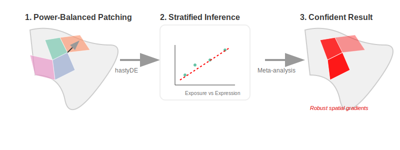

# SpatialStratifiedDE

  

A framework for spatially stratified differential expression analysis, developed during the [Bioconductor Venice Hackathon 2026](https://github.com/BiocCodingCollaborations/VeniceHackathon2026).

## Overview

Traditional differential expression (DE) testing in spatial transcriptomics often ignores spatial autocorrelation and the heterogeneity of responses across tissue regions. **SpatialStratifiedDE** (or *SpaceMosaic*) addresses this by:

1.  **Patching:** Splitting the tissue into small, contiguous "patches" optimized for statistical power.
2.  **Stratified DE:** Running efficient OLS-based DE testing within each patch.
3.  **Meta-analysis:** Aggregating patch-level results via spatially smoothed meta-analysis to regain power and identify robust biological patterns.

## Repository Structure

The repository is organized as follows:

-   `R/`: Contains core function definitions (e.g., `getPatches`, `patchDE`).
-   `vignettes/`: A comprehensive case study and walkthrough using MERFISH data.
-   `examples/`: Original exploratory scripts and analysis files from the hackathon.
-   `results/plots/`: Key visualizations from the analysis workflow.

## Installation

To explore this project, clone the repository and ensure you have the necessary dependencies.

## Quick Start

The best way to understand the workflow is to explore the main vignette:

1.  Open `vignettes/SpatialStratifiedDE_Vignette.Rmd` in RStudio.
2.  Knit the document to view the step-by-step analysis of the mouse colon MERFISH dataset.

## Methodology

### 1. Patch Definition (`getPatches`)
Employs an iterative algorithm to shift patch borders, ensuring homogeneous statistical power across the tissue by maximizing the sum of squares of the design variable.

### 2. Stratified DE (`patchDE` & `hastyDE`)
Performs high-efficiency OLS on Pearson residuals. This approach scales to 18,000+ genes across 1,000+ patches in seconds.

### 3. Subgroup Meta-analysis
Identifies biologically similar patches and combines their results to produce precise, high-confidence estimates even from individually under-powered regions.

## Contributing

We welcome contributions! Please see our [Contributing Guidelines](CONTRIBUTING.md) for more information on how to get involved.

## Code of Conduct

All participants in this project are expected to follow our [Code of Conduct](CODE_OF_CONDUCT.md) to ensure a welcoming and inclusive environment.

## License

This project is licensed under the **MIT License**. See the [LICENSE](LICENSE) file for the full text.

## Authors

This project was a collaborative effort during the [Bioconductor Venice Hackathon 2026](https://github.com/BiocCodingCollaborations/VeniceHackathon2026):

-   **Patrick Danaher** ([@pdanaher](https://github.com/pdanaher)) - Lead methodology and core R development.
-   **Matteo Calgaro** ([@mcalgaro93](https://github.com/mcalgaro93)) - Implementation, workflow design, and repository management.
-   **Robert Castelo** ([@rcastelo](https://github.com/rcastelo)) - Code review and optimization.
-   **Pere Moles Serò** ([@peremoles](https://github.com/peremoles)) - Analysis and testing.

---

*Developed with the assistance of Gemini CLI.*
